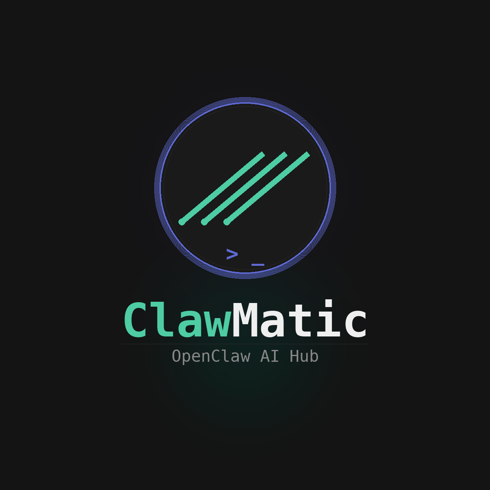
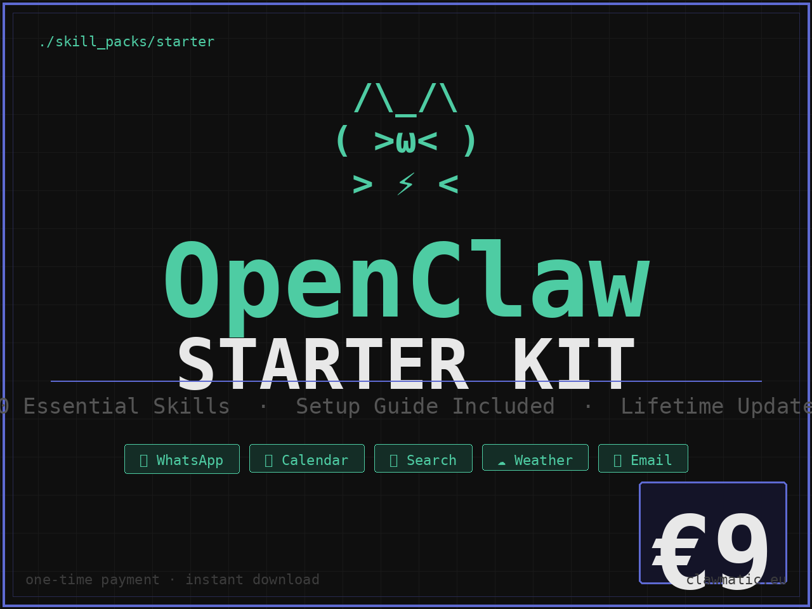

  

<h1 align="center">ClawMatic</h1>

  <strong>OpenClaw AI Hub</strong> 
  Guides, skill packs, and tools to automate your life with AI agents.

  <a href="https://clawmatic.eu">Website</a> ·
  <a href="https://github.com/Clawmatic/clawmatic">GitHub</a> ·
  <a href="https://clawmatic.gumroad.com">Gumroad</a>

  
  
  

---

## What is ClawMatic?

ClawMatic is the home for practical OpenClaw tutorials, starter kits, and premium skill packs.
It's built for people who want to move fast, automate the boring stuff, and actually ship useful AI workflows.

### What you'll find here
- Step-by-step OpenClaw guides for Windows, macOS, and Linux
- Downloadable skill packs and starter kits
- Practical automation tips for real workflows
- A growing set of tools and docs around OpenClaw

### Current focus
- Make OpenClaw easier to install and use
- Ship polished beginner-friendly guides
- Build useful skill packs that save time immediately
- Keep the experience clean, fast, and a little bit fun

---

## Featured download

### OpenClaw Starter Kit
A ready-to-use starter pack to help you get going faster.

  

Download: [openclaw-starter-kit-v1.0.0.zip](public/openclaw-starter-kit-v1.0.0.zip)

---

## Roadmap

- Public launch polish
- More guides and screenshots
- More skill packs
- Better onboarding for new users
- A stronger brand page for the OpenClaw ecosystem

---

## Notes

This repo is currently private while the site and content are still being refined.
When it goes public, this README will already be ready for visitors instead of the usual boring boilerplate.
